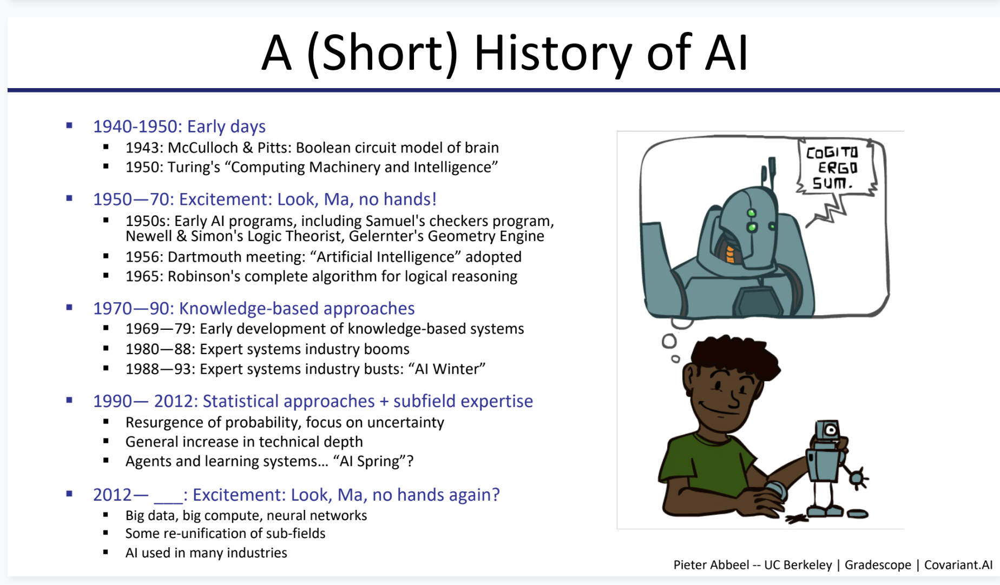

# Overview

## Why?

When a 15 year old cares more about the research papers and research methodology than kardashians or pew dii pew\(whatever!\), then the critical thinking skills will start to serve the society. Reading research papers are only sure way to increase the maturity required to do the research 


```
$ give me critical-thinking powers
```



The research paper that introduced concepts are used in modern industry will be covered more than older research papers

