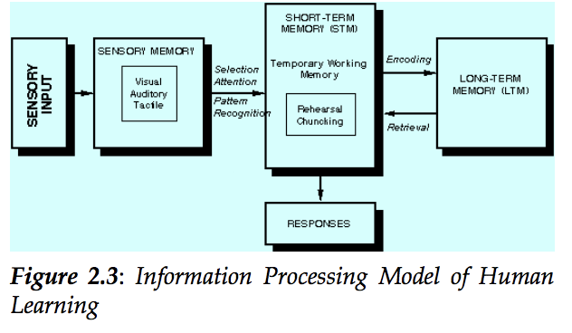

# Theories of Thinking

There are tons of different theories Psychologists have put forward on how individuals acquire knowledge, organize and deploy intelligence.   For this summary, learning theories are grouped into three basic categories:

* Behaviorist learning theories 
* Cognitive-information processing learning theories 
* Cognitive-constructivist learning theories

**Behaviorist learning theories:** The primary goal of this theory was to establish a baseline model on how organism think. This theory was mostly based on behavior of lower level organism.It is generally described as **Associationism**. Elementary laws of learning captured in these theories could account for a number of behaviors such as trial-and-error learning and simple discrimination learning in lower level organisms.Biologists have also described such behaviors like Phototropism\[response for light\] etc.

Pavlov combined reflex action and associationism on his famous Dog experiment. This elementary theory was extended as classical **conditioning theory.** 

**Cognitive-Information Processing Theories:**According to the cognitive information processing \(CIP\) view, the human learner is conceived to be a processor of information, in much the same way a computer is. When learning occurs, information is input from the environment, processed and stored in memory, and output in the form of a learned capability.  

_Sensory Memory_ : Represents the first stage of information processing. Associated with the senses \(vision, hearing, etc.\), it functions to hold information in memory very briefly, just long enough for the information to be further processed.

_Selection Attention_:Refers to the learners' ability to select and process certain information while simultaneously ignoring other information. 

> Just attending to information is not enough to ensure its further processing. Attention is believed to be necessary but not sufficient; information must be analyzed, and familiar patterns must be identified to provide a basis for further processing.

_Pattern Recognition_: Refers to the process whereby environmental stimuli are recognized as exemplars of concepts and principles already in sensory memory.

_Short-Term Memory_ : \(STM\) functions as a temporary working memory where further processing is carried out to make information ready for long term storage or a response

_Rehearsal & Chunking: T_wo processes that may help individuals encode information into long-term memory.

_Encoding_: Refers to the process of relating incoming information to concepts and ideas already in long-term memory in such a way that the new material is more memorable.

_Long-term memory \(LTM\)_:  Represents our permanent storehouse of information.

_Retrieval  :_ The process of retrieval from long-term memory is relatively simple to understand. Previously learned information is brought back to mind, either for the purposes of understanding some new input or for making a response.

