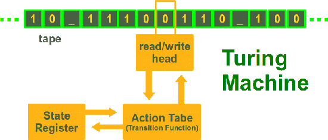

# Thinking Machines

This paper explores the possibility of the thinking machines and more specifically what can be called as the thinking machines? What is the definition of the thinking machines?

Alan Turing describes "Thinking Machines" as a game, "Imitation game". In this game, there are two players and one judge. Players have to help the judge identify them. The trick is Player A and Player B are not playing by the same rules. Player A has to trick judge so that he can't be identified while Player B has to help judge identify itself. All these players are in separate room and the only form of communication is that they can send a message-\[typed and printed\]. 

Now, let's say you replace the Player A with a machine\[Calculator? or Alien?\]. Will that machine be able to trick the Judge. But the machine strictly has to be non-biological and what can be called as digital computer\[Analogy: a "human" which would follow a set of fixed rules using an unlimited supply of paper for calculations\]. This analogy was needed given most people were not familiar with computing and computers.

Turing defined a digital computer as having:

* A `Store` of information for calculations and rules the computer must follow.
* An `Executive unit` which carries out the individual operations.
* A `Control` which ensures that instructions are performed in accordance with the rules and in the correct order. 

Instructions are basically the imperative code that we write nowadays. The way of Instructing has changed a lot. Now, we can instruct computers using English or any other language. But Turing had to instruct in a very mechanical way. Here is the example: 

Numbers should be assigned to parts of the store, allowing the machine to receive instructions like ‘Add the number stored in position 6809 to that in 4302 and put the result back into the latter storage position’. These instructions would be expressed in a machine language something like - ‘6809430217’ - where 17 references the type of instruction, as defined by the rulebook.

> Computers are mathematical systems which perform strictly by the rulebook they are given..

He went on to discuss about the objections: Theological,Mathematical etc. Despite objections, he talks about how education/evolution might help with Thinking Machines. Words of Alan Turing himself..

> “We may hope that machines will eventually compete with men in all purely intellectual fields. But which are the best ones to start with? Even this is a difficult decision. Many people think that a very abstract activity, like the playing of chess, would be best. It can also be maintained that it is best to provide the machine with the best sense organs that money can buy, and then teach it to understand and speak English. This process could follow the normal teaching of a child. Things would be pointed out and named, etc. Again I do not know what the right answer is, but I think both approaches should be tried.
>
> We can only see a short distance ahead, but we can see plenty there that needs to be done.”

## Code and Implementation of a simple :Thinking Machine  

  

In order to simulate a Turing Machine, we need the following things:

* The initial tape.
* The transitions, which is a dictionary that maps a state to a set of rules. Each rule maps a tape symbol to a state change.
* A starting state number and starting tape position.



